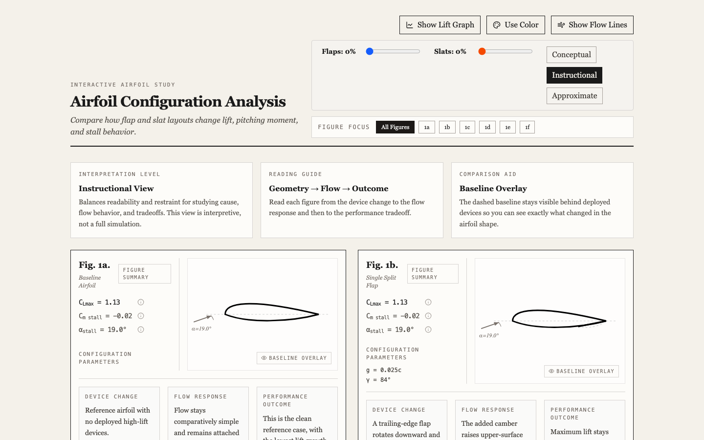
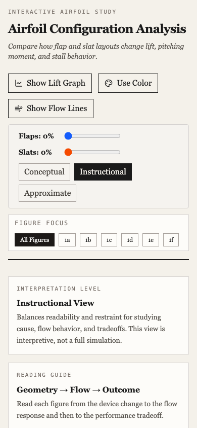

# Foil

Foil is an interactive airfoil configuration study focused on how flaps and slats affect lift, pitching moment, and stall behavior.

Live site: [https://augustave.github.io/foil/](https://augustave.github.io/foil/)

## Screenshots





## What it does

- Compares six airfoil configurations from baseline through multi-element high-lift systems
- Lets you vary flap and slat deployment interactively
- Shows an optional lift-vs-angle graph for quick comparison
- Explains each configuration through device change, flow response, performance outcome, main benefit, tradeoff, and typical use

## Controls

- `Flaps` changes trailing-edge device deployment across the non-baseline configurations
- `Slats` changes leading-edge device deployment on the multi-element layouts
- `Show Lift Graph` toggles the comparison chart
- `Use Color` switches between monochrome and figure-color emphasis
- `Show Flow Lines` overlays animated streamlines for a more readable flow sketch
- `Figure Focus` filters the page to a single figure or shows the full set

## Stack

- React
- Vite
- Tailwind CSS
- `lucide-react`

## Local development

```bash
npm install
npm run dev
```

The dev server will print a local URL, usually `http://localhost:5173`.

## Production build

```bash
npm run build
npm run preview
```

The production build outputs static assets to `dist/`.

## Deployment

GitHub Pages deploys automatically from `main` using the workflow in `.github/workflows/deploy.yml`.

Because the site is served from the repository path, Vite is configured with:

```js
base: '/foil/'
```

## Project structure

```text
.
├── .github/workflows/deploy.yml
├── index.html
├── package.json
├── src/
│   ├── App.jsx
│   ├── index.css
│   └── main.jsx
└── vite.config.js
```

## Notes

This is an instructional visualization, not a validated aerodynamic simulator or wind-tunnel reconstruction.
